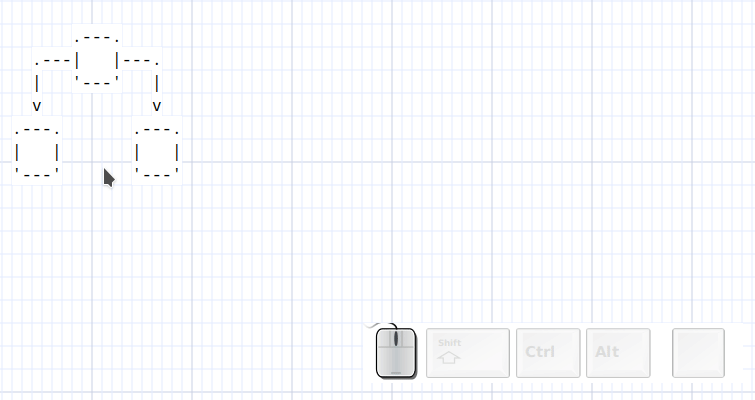

# Grouping elements

Grouping elements allows you to organize and manipulate multiple objects as a single unit.

Grouping helps you manage complex diagrams by treating grouped elements as a cohesive entity. You can visually distinguish between different element or categories by grouping related elements together.

Manipulating a group as a single unit saves time and effort compared to modifying each element individually. You can quickly move entire sections of your diagram without having to select each element separately.

Grouping ensures that all elements within a group maintain their relative positions and alignments.

## Selecting Elements

To create a group, you first need to select multiple elements in your diagram. You can do this by clicking and dragging a selection box around the desired elements or by individually selecting each element while holding down a modifier key.

## Group Creation

***Binding:*** gg

Please note that the grouped elements in the diagram program are visually differentiated from other elements by having a slightly distinct background. This distinction aids in easily identifying and distinguishing the elements that have been grouped together.

## Group Manipulation

After creating a group, you can manipulate it as a single entity. For example, you can move, copy, or align the entire group as if it were a single object. Any modifications you make to the group, such as changing its color or style, will apply to all the elements within it.

## Ungrouping

***Binding:*** gu

When you want to edit individual elements within a group or remove them from the group, you can ungroup them. This action separates the grouped elements back into their original individual objects.

