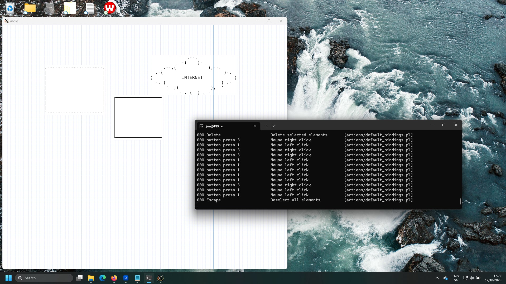

# Installation

We're working on having packages pre-build for different distributions

## CPAN vs dev versions

The CPAN version is the stable version but we recommend running the latest from github to get most of *asciio*

## Manual install of CPAN version on Ubuntu (probably other debian derivates too)

```bash
    apt install libdata-compare-perl libdata-compare-perl libdirectory-scratch-structured-perl libeval-context-perl libextutils-pkgconfig-perl libfile-homedir-perl libgtk3-perl libio-prompter-perl libterm-size-any-perl libterm-termkey-perl libtest-block-perl libtermkey-dev libmodule-build-perl libsereal-perl libcompress-bzip2-perl libpango-perl libcarp-clan-perl libtest-deep-perl libtest-most-perl libdevel-stacktrace-perl libexception-class-perl libcapture-tiny-perl libtest-differences-perl libmodule-util-perl libtest-nowarnings-perl 

    cpan install Data::TreeDumper::Renderer::GTK App::Asciio

```

## container

### pull image from docker hub

Image is at: https://hub.docker.com/r/nadimkhemir/asciio

No night builds yet but it will come, should you need a newer version jut open a ticket. 

Change <YOUR_USER_NAME_HERE> to your user name before running the command below.

### linux

```bash
podman run -it --net=host --env="DISPLAY" --volume="$HOME/.Xauthority:/root/.Xauthority:rw" --volume="$HOME:/home/<YOUR_USER_NAME_HERE>" asciio:1.9.02 asciio

```

### windows wsl
If using Podman, add docker repository to podman in '/etc/containers/registries.conf'


```
[registries.search]
registries = ['docker.io']
```

Install an Xserver in windows. I used [VcXsrv](https://vcxsrv.com/) and disabled access control.

The IP of Xserv was not correct. Had to use this, to have it report the Windows host virtual IP: 
```
export DISPLAY=$(ip route | grep default | awk '{print $3}'):0
```

```bash
podman run -it --net=host --env="DISPLAY" --volume="$HOME:/home/<YOUR_USER_NAME_HERE>" asciio:1.9.02 asciio

```





### build your own

Using the instructions above build an asciio image ; the image will be large (~700 MB) as it contains gtk and co.

## Windows

In the windows environment, you can use asciio through WSL or cygwin.

### WSL

The use of WSL is not much different from the Linux environment.However, there are some things that need attention. This link talks about how to connect to the WSL environment and execute GUI programs through remote connections under Windows.

[remote_wsl_use_gui_app](https://github.com/qindapao/linux_app_use_in_windows/blob/main/remote_wsl_use_gui_app.md)

### Cygwin

- First install [Cygwin](https://www.cygwin.com/).
- Make sure the following components are installed correctly
   - x11
   - perl
   - Gnome
   - gun-make
   - gcc-g++
- Search for "gcrypt" in all the packages to be installed, and install all 
  the packages that appear.
- Install all dependent modules of asciio

Pay attention when installing perl modules, some may be installed through 
cpan, but some cannot, and can only be installed manually.

>When compiling, the Makefile of several modules has an unrecognized option 
`-lnsl`. removed it when install it manually.

Start asciio by the following method:

```bash
startxwin >/dev/null 2>&1 &
export DISPLAY=:0.0
asciio
```

# Running asciio

    $> asciio [file.asciio] # GUI application using Gtk3

    $> tasciio [file.asciio] # TUI application

    $> asciio_to_text file.asciio # converts asciio files to ASCII


# Platforms

Asciio is developed on both Linux and Windows (cygwin).
