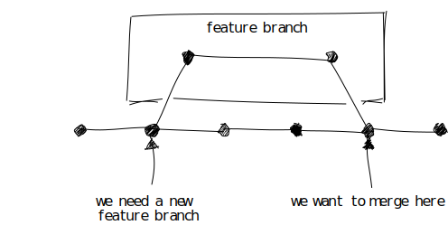
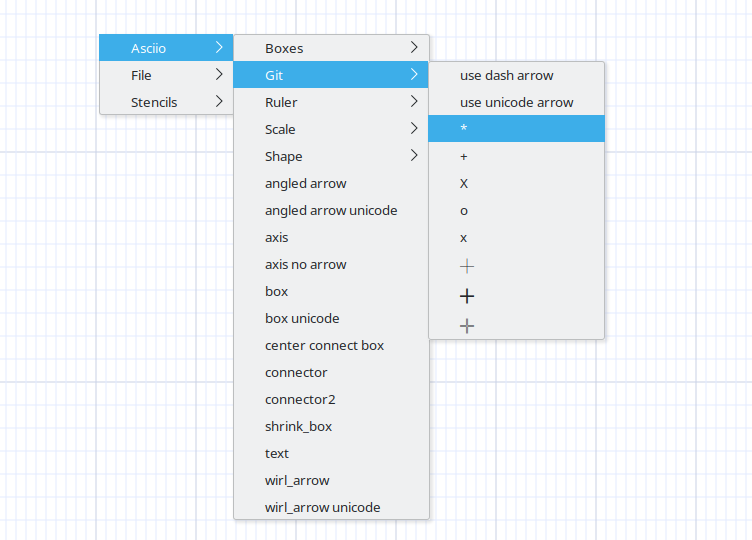

# git

```

                     .*-----*------------------------------*
                    /                                       \
                   /                                         \
           *------*---------*-----BETA---.                    \
                   \                      \                    \
                    \    .-----.           '                    \
 .-------------.     *---| fix |---*-----RELEASE 1.3------>*-----*---------*
 | Release 2.0 |         '-----'    \                     /               /
 |-------------|                     \                   /               /
 | changes     |------------------->  '---*-------*--------------*------*
 | tag: ...    |                           \           /
 | eta: ...    |                            \         /
 '-------------'                             *-------'

```

The *git mode* allows you to draw git graph quickly.

The *git mode* redefines some bindings to allow you to work faster. Only the bindings listed below are available when editing.

| action                     | binding                 |
| --------------             | ---------               |
| Exit git mode              | «Escape»                |
| Undo                       | «u»                     |
| ***Insert and link node*** | «g» «right-click»       |
| Change arrow direction     | «d»                     |
| Add box                    | «b»                     |
| Add text                   | «t»                     |
| Add arrow                  | «a»                     |
| Select objects             | «left-click»            |
| Edit Selected element      | «Return» «double-click» |
| Delete elements            | «Delete» «x»            |
| Flip hint lines            | «h»                     |
| Display popup menu         | «alt+right-click»       |


When you ***insert and link a node***:

- if nothing is under the pointer or selected, it will insert a commit node
- if a node is selected and nothing under the pointer, it will insert a new node and connect with the previously selected node
- if a node is selected and the pointer is over a node, it will link the nodes

Let's create a git graph.


You can export the text and use it in our documentation

```
                 .----------------------------------.
                 |          feature branch          |
                 |                                  |
                 |       *-------------------*      |
                 |      /                     \     |
                 |     /                       \    |
                 '----/-------------------------\---'
                     /                           \
          *---------*---------*---------*---------*---------*
                    ^                             ^
                    |                             |
                    |                             |
                    |                             |
             we need a new              we want to merge here
             feature branch

```

or you can generate some fancy SVGs for a presentation.





The connector and arrow type of the git mode can be changed.

In the user configuration for the connector,

```perl
GIT_MODE_CONNECTOR_CHAR_LIST => ['*', 'o', '+', 'x', 'X', '┼', '╋', '╬'],
```

or in the popup menu for both.




