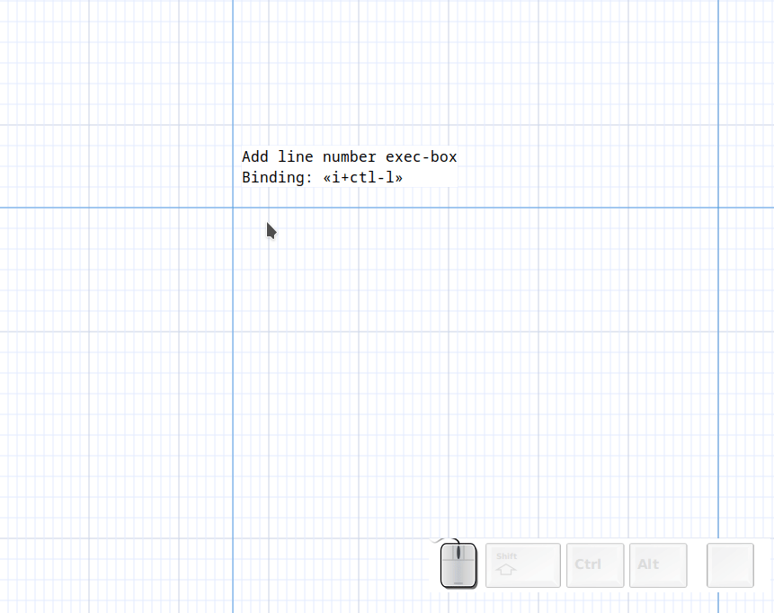

# Asciio exec-boxes

An "exec-box" is and object that lets you run an external command and put its output in a box. There are different types of exec-boxes explained below.

## Multi command

Binding: «ie» Add exec box              

The simplest exec-box accepts multiple commands, one per line. It will redirect stderr for each command.

Editing the box will let you edit the command.

## Verbatim 

Binding: «iv» Add exec box verbatim     

This exec-box doesn't redirect stderr, you can use it for commands that span multiple line or commands that take a multi line input

Editing the box will let you edit the command.

## Once

Binding: «io» Add exec box verbatim once

This exec-box will run your commands once, editing the box will let you edit the command's output.

## Add line numbers

Binding: «i + c-l» Add line numbered box     

This is an example of a custom stencil which will add line numbers to your input.

## Examples

### Using previously generated output

If you already have text in a file you can use 'cat your_file' as the command.

### Tables

tbd: Command: ...

      +------------+------------+------------+------------+
      | input_size ‖ algorithmA | algorithmB | algorithmC |
      +============+============+============+============+
      |     1      ‖ 206.4 sec. | 206.4 sec. | 0.02 sec.  |
      +------------+------------+------------+------------+
      |    250     ‖     -      |  80 min.   | 2.27 sec.  |
      +------------+------------+------------+------------+

### Figlet

tbd: Command: ...

### Diagon

tbd: Command: ...
